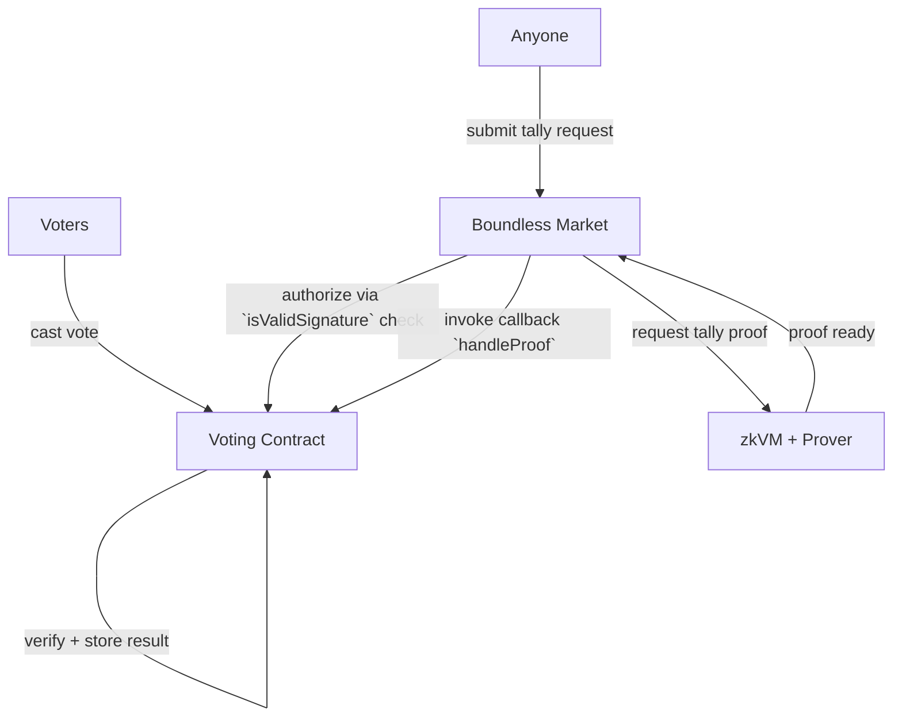

# Boundless

## Notes

- Callbacks

  - The marketplace can invoke a callback when a proof has been generated

- Requestors

  - A nice way to allow proof requests in a permissionless way

  - Someone invokes a method on a smart contract that request a proof via the marketplace

  - Boundless checks if the user is allowed to request that proof (via the `isValidSignature` function)

    - if valid, the contract pays the marketplace for the proof

## Idea

I want to do something unique but keep it straightforward and minimalist. Originally, I wanted to do the sealed acuction project as mentioend in the document, but I decided to pivot to a simple voting application when I read about Callbacks and Requestors.

The idea is that members of a community/DAO/.. can vote on a simple proposal and anyone can invoke the tally process through Smart Contract Requestors (that way no single entity has control over when or if to start the tally process). Once Boundless generates the proof of the tally, it invokes a callback in a Solidity contract, provides the proof of the tally and the contract, via the callback, verifies the proof and settles the tally.

