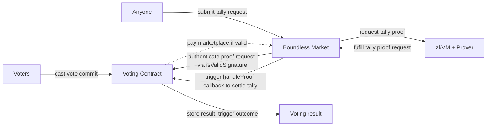

# Boundless

## Notes

- Callbacks
  - The marketplace can invoke a callback when a proof has been generated
- Requestors
  - A nice way to allow proof requests in a permissionless way
  - Someone invokes a method on a smart contract that request a proof via the marketplace
  - Boundless checks if the user is allowed to request that proof (via the `isValidSignature` function)
    - if valid, the contract pays the marketplace for the proof

## Idea

I want to do something unique but keep it straightforward and minimalist. Originally, I wanted to do the sealed acuction project as mentioend in the document, but I decided to pivot to a simple voting application when I read about Callbacks and Requestors.

The idea is that members of a community/DAO/.. can vote on a simple proposal and anyone can invoke the tally process through Smart Contract Requestors (that way no single entity has control over when or if to start the tally process). Once Boundless generates the proof of the tally, it invokes a callback in a Solidity contract, provides the proof of the tally and the contract, via the callback, verifies the proof and settles the tally.

The voters only send a commit of their vote to the EVM contract `H(address || choice || proposalID)` where `choice` is `choice ∈ {YES, NO}`. The voting contract stores the commits in a Merkle List (a hashed list) so that the prover can't omit certain votes.

For simplcity, I will omit a bunch of application specific checks but mention them where needed (e.g. check that the deadline has passed before finishing the tally, ..). Additionally, one contract serves for everything: the voting app specific logic, the callback and the smart contract requestor via `isValidSignature` - this is a deliberate design choice to keep thigs minimal and simple.

